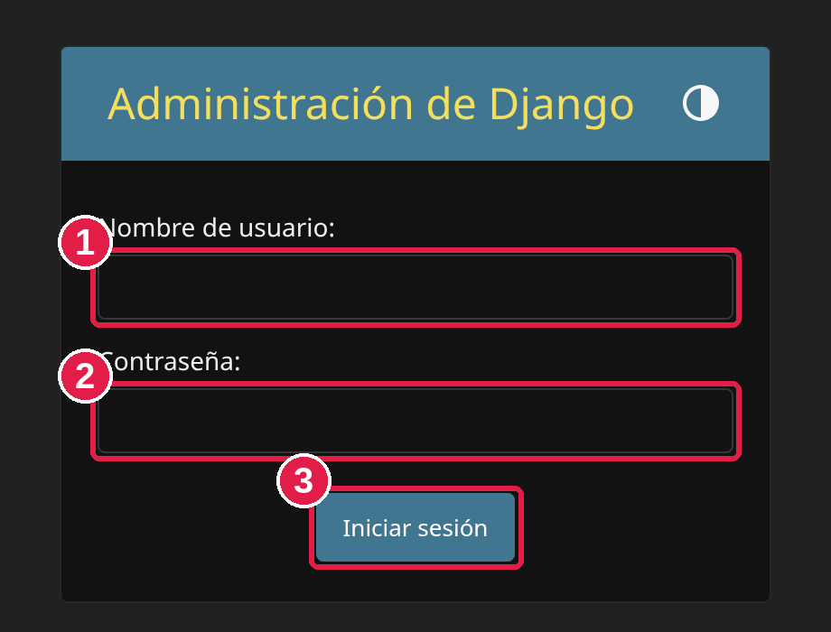
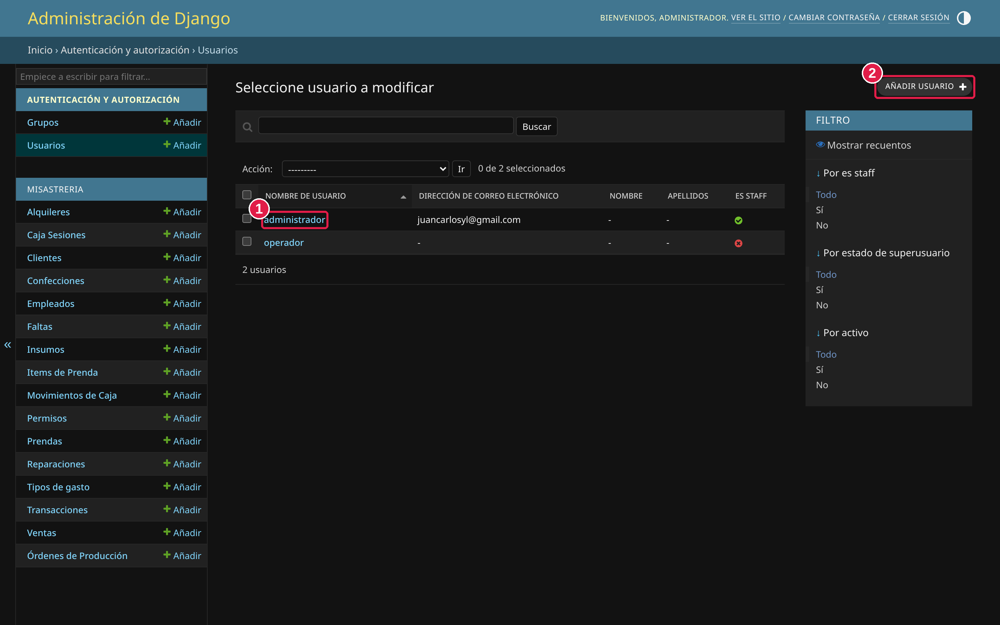
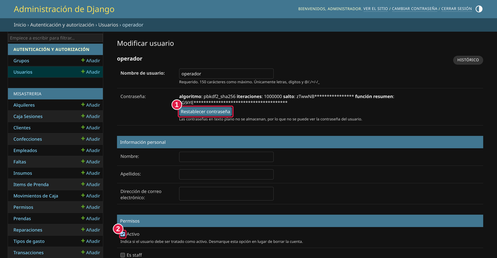
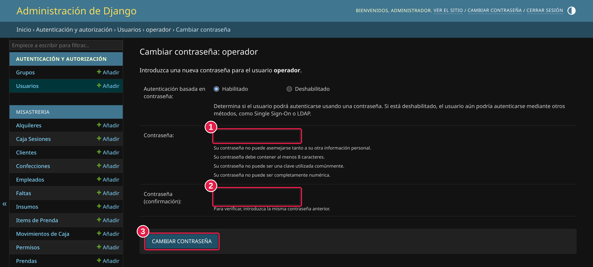
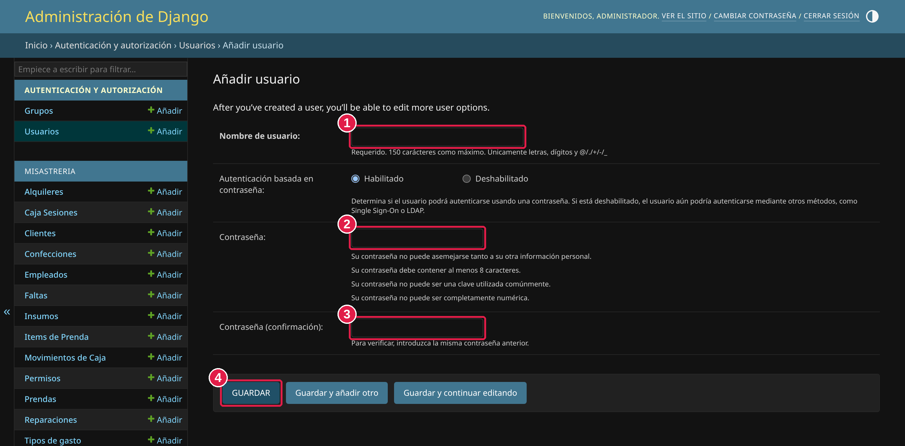

# Manual del Administrador — Fortium Tailor

> **Solo para el dueño.**
> Este es un panel especial, aparte del sistema de todos los días. Sirve para cosas
> que el sistema normal no permite, como **cambiar la contraseña de alguien** o
> **crear un usuario nuevo**. Es sencillo de usar siguiendo los pasos de abajo.
>
> En las imágenes de este manual, los **círculos rojos con números** (1, 2, 3…) te
> muestran exactamente dónde hacer clic, en el mismo orden que los pasos.

---

## 1. Cómo entrar

Abrí tu navegador de internet (Chrome, Edge, etc.) y entrá a la dirección del
sistema **agregando `/admin/` al final**.

> Si no estás seguro de cuál es la dirección, la persona que te instaló el sistema
> te la puede pasar. En la computadora de la tienda suele ser:
> `http://localhost:8001/admin/`

Vas a ver esta pantalla, donde te pide entrar:

1. En **Nombre de usuario**, escribí tu usuario de administrador.
2. En **Contraseña**, escribí tu contraseña.
3. Hacé clic en **Iniciar sesión**.

> Esta entrada es solo para vos (el administrador). Los empleados que usan el
> sistema día a día **no** pueden entrar acá.

---

## 2. La pantalla principal

Una vez adentro, mirá la **lista de la izquierda**. Lo único que vas a necesitar
está en la parte de arriba, donde dice **Usuarios**. Ahí se manejan las personas
que pueden entrar al sistema y sus contraseñas.

> Más abajo aparece una lista larga (Clientes, Ventas, Caja, etc.). **No hace falta
> que toques nada de eso**: esas cosas se manejan desde el sistema normal. Este
> manual solo cubre **Usuarios**.

---

## 3. Cambiar la contraseña de una persona  ⭐ (lo más común)

**Paso 1 — Abrí la lista de usuarios.**
En la columna de la izquierda hacé clic en **Usuarios**. Vas a ver a todas las
personas que tienen acceso:

- **(1)** Para cambiarle la contraseña a alguien, hacé clic sobre **su nombre**
  (por ejemplo `operador`).
- **(2)** El botón **AÑADIR USUARIO** (arriba a la derecha) sirve para crear uno
  nuevo — eso lo vemos en el punto 4.

**Paso 2 — Abrí el cambio de contraseña.**
Al hacer clic en el nombre, se abre la ficha de esa persona. Arriba, en el recuadro
**Contraseña**, hacé clic en el botón **Restablecer contraseña**:

> **(1)** es el botón **Restablecer contraseña**.
> Es normal que la contraseña actual no se vea: por seguridad nunca se muestra.

**Paso 3 — Escribí la contraseña nueva.**
Se abre esta pantalla:

1. Escribí la **contraseña nueva**.
2. Escribí **la misma contraseña otra vez** para confirmar.
3. Hacé clic en **CAMBIAR CONTRASEÑA**.

**La contraseña debe cumplir estas reglas** (si no, el sistema no la acepta):
- Tener **8 caracteres o más**.
- No parecerse al nombre de usuario.
- No ser una contraseña demasiado fácil o común (ejemplo: `12345678`).
- No ser solamente números.

✅ Listo. Avisale a la persona su contraseña nueva.

---

## 4. Crear un usuario nuevo (dar acceso a alguien)

**Paso 1.** Entrá a **Usuarios** (columna izquierda) y hacé clic en
**AÑADIR USUARIO**, arriba a la derecha (el **(2)** de la imagen del punto 3).

**Paso 2.** Se abre este formulario. Completá los campos marcados:

1. **Nombre de usuario** — con el que la persona va a entrar. *(Obligatorio)*
   Sin espacios; pueden ser letras y números.
2. **Contraseña** — la clave para entrar. *(Obligatorio)*
3. **Contraseña (confirmación)** — la misma contraseña otra vez. *(Obligatorio)*
   Tiene las mismas reglas del punto 3.
4. Hacé clic en **GUARDAR**.

> El recuadro "Autenticación basada en contraseña" déjalo como está (**Habilitado**).

**Paso 3 (opcional).** Después de guardar, el sistema abre la ficha completa de la
persona. Ahí podés llenar datos **que NO son obligatorios** y podés dejar en blanco:

- **Nombre**, **Apellidos** y **Dirección de correo electrónico** → opcionales.

Si no los llenás, no pasa nada: el usuario igual funciona. Si los completás, hacé
clic en **GUARDAR** abajo de la página.

---

## 5. Quitar o dar acceso sin borrar a nadie

En la ficha de una persona (la del punto 3) hay una casilla llamada **Activo**
(marcada con el círculo **(2)** en esa imagen):

- **Casilla "Activo" marcada** → la persona **puede entrar** al sistema.
- **Casilla "Activo" desmarcada** → la persona **no puede entrar**, pero **no se
  borra** y no se pierde su historial.

👉 Cuando un empleado deja de trabajar, lo mejor es **desmarcar "Activo"** (en vez de
borrarlo) y luego bajar hasta el final de la página y apretar **GUARDAR**.
Si vuelve, volvés a marcar "Activo" y queda como antes.

> Las casillas **"Es staff"** y **"Superusuario"**, que están justo debajo, dan
> acceso a este panel de administración y a permisos avanzados. **Dejalas
> desmarcadas** para los empleados normales. Solo el dueño debería tenerlas marcadas.

---

## 6. Salir

Cuando termines, hacé clic en **CERRAR SESIÓN**, arriba a la derecha. Es importante,
sobre todo si la computadora la usan varias personas.

---

## ⚠️ Recomendaciones

- **No borres usuarios.** Para quitarle el acceso a alguien, desmarcá **"Activo"**
  (punto 5). Así no se pierde nada.
- **Usá este panel solo para usuarios y contraseñas.** Las ventas, la caja, los
  empleados y todo lo demás se manejan desde el sistema normal.
- Los cambios acá se guardan al instante y **no se pueden deshacer**, así que revisá
  antes de apretar GUARDAR.
